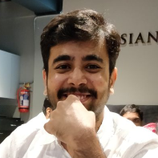
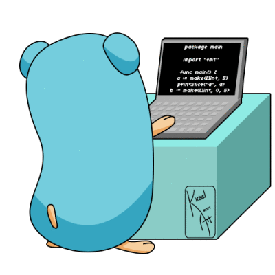
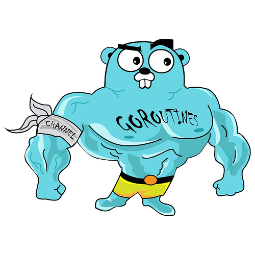

layout: true

.signature[@gauravagarwalr]

---

class: center, middle

# Go concurrency constructs

Gaurav Agarwal

---

class: center, middle

Lead Technical Consultant @ .tarkalabs-logo[]

ex-ThoughtWorker, ex-BrowserStackian, Independent Consultant

Involved in Chennai Go community for ~6 months

---

# Agenda

* A simple scraper
* Making the scraper concurrent
  * Go routines
  * sync.WaitGroup
  * Mutexes
  * Channels

---
class: center, middle

# Simple Scraper

---
class: center, middle

# Goroutines

---
class: center, middle

# sync.WaitGroup

---
class: center, middle

# Controlling shared access using mutexes

JSON Streams to JSON array

---

# Channels

* Unbuffered (1 item)
* Buffered (n items)

---
class: center, middle

---

# References

* Rob Pike's ["Go Concurrency Patterns"](https://www.youtube.com/watch?v=f6kdp27TYZs)
* Vagmi Mudumbai's ["Thinking in Go"](https://www.youtube.com/watch?v=6ce54mscaKo)
* [Tour of Go](https://tour.golang.org/concurrency)
* Go by example - [Mutexes](https://gobyexample.com/mutexes)

---
class: center, middle

Code: https://github.com/Chennai-Golang/go-concurrency-constructs

Slides: https://go-concurrency.presentation.gauravagarwalr.com
