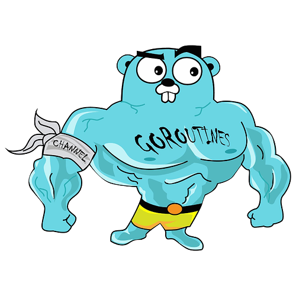
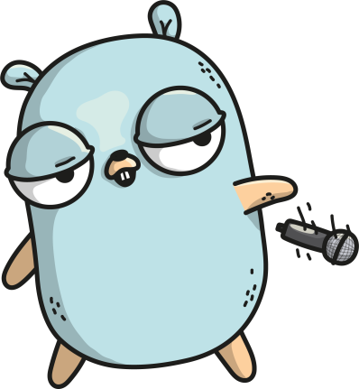

layout: true

.signature[@gauravagarwalr]

---

class: center, middle

# Go concurrency constructs

Gaurav Agarwal

---

class: center, middle

Lead Technical Consultant @ Tarka Labs

Ex-ThoughtWorker, Ex-BrowserStackian, Independent Consultant

Involved in Chennai Go community for ~6 months

---

# Agenda

1. A simple scrapper
2. Making the scrapper concurrent
* Go routines
* sync.WaitGroup
* Mutexes
* Channels

---

# Simple Scraper

---
class: center, middle

# Goroutines

---
class: center, middle

# sync.WaitGroup

---
class: center, middle

# Controlling shared access using mutexes

JSON Streams to JSON array

---

# Channels

* Buffered
* Unbuffered

---
class: center, middle

---
class: center, middle

Code: https://github.com/Chennai-Golang/go-concurrency-constructs

Slides: https://go-concurrency.presentation.gauravagarwalr.com
